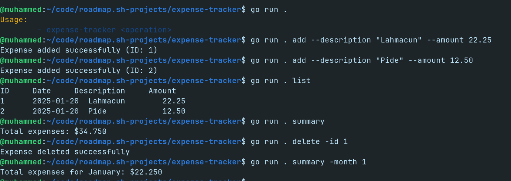

# GitHub User Activity

Sample solution for the [expense-tracker](https://roadmap.sh/projects/expense-tracker) challenge from [roadmap.sh](https://roadmap.sh/golang/projects).

## Installation

1. Clone the repository:
```bash
 git clone https://github.com/muhammedkucukaslan/roadmap.sh-projects.git
```
2. Navigate to the project directory:
```bash
 cd expense-tracker
```
3. Build the project: 
```bash
 go run .
```



