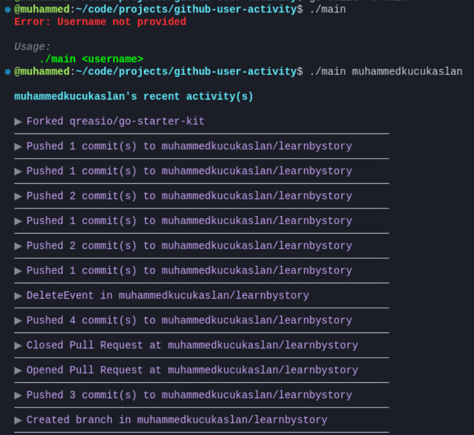

# GitHub User Activity

Sample solution for the [github-user-activity](https://roadmap.sh/projects/github-user-activity) challenge from [roadmap.sh](https://roadmap.sh/golang/projects).

## Installation

1. Clone the repository:
```bash
 git clone https://github.com/muhammedkucukaslan/roadmap.sh-projects.git
```
2. Navigate to the project directory:
```bash
 cd github-user-activity
```
3. Build the project:
```bash
 go build -o main
```

## Usage

To run the program, use the following command:

```bash
 ./main <username>
```

Example:
```bash
 go run main.go muhammedkucukaslan
```




