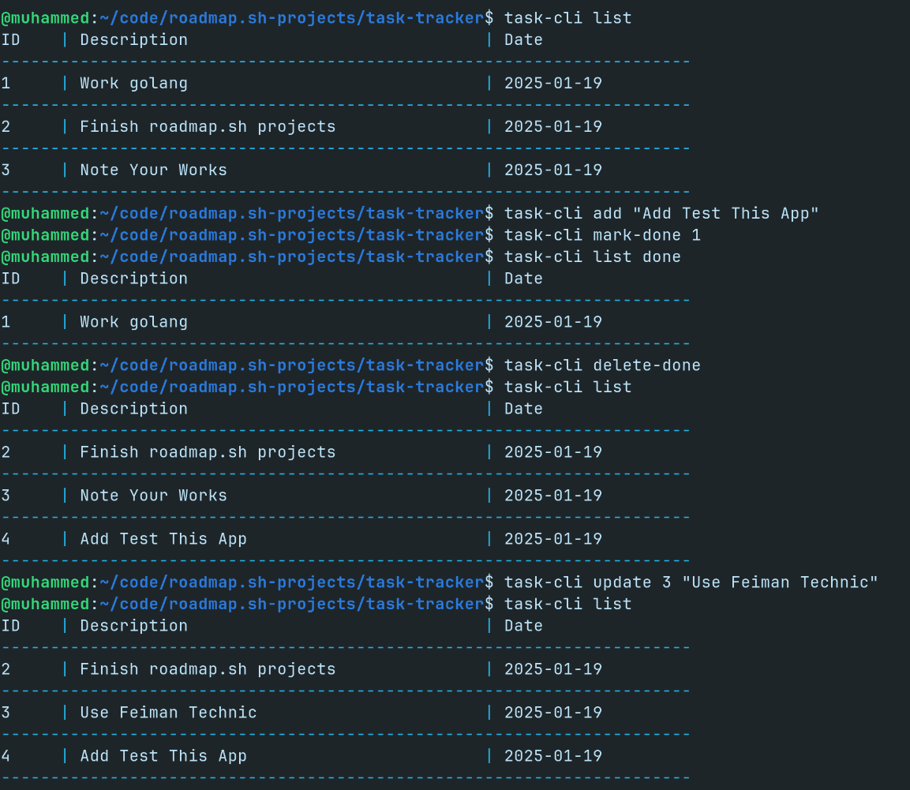

# Task Tracker

Sample solution for the [task tracker](https://roadmap.sh/projects/task-tracker) challenge from [roadmap.sh](https://roadmap.sh/golang/projects).

## Installation

1. Clone the repository:
```bash
 git clone https://github.com/muhammedkucukaslan/roamdap.sh-projects
```
2. Navigate to the project directory:
```bash
 cd task-tracker
```
3. Build the project:
```bash
 go build -o task-cli
```
4. Move to /usr/local/bin:
```bash
 sudo mv task-cli /usr/local/bin
 ```
5. Use it anywhere:
```bash
 task-cli list
 ```
## Addition

I have added a new `deleteDone()` function to delete all the tasks that are done.

```bash
@muhammed:~$ task-cli delete-done 
// All the tasks that are done are deleted.
```


## Usage

To run the program, use the following command:

```bash
@muhammed:~$ task-cli 
Usage:
	task-cli <operation>
Operations:
	 add <task>
	 list <filter>
	 delete <id>
     delete-done
	 update <id> <task>
	 mark-in-progress <id>
	 mark-done <id>

```

I have implemented the following operations:



