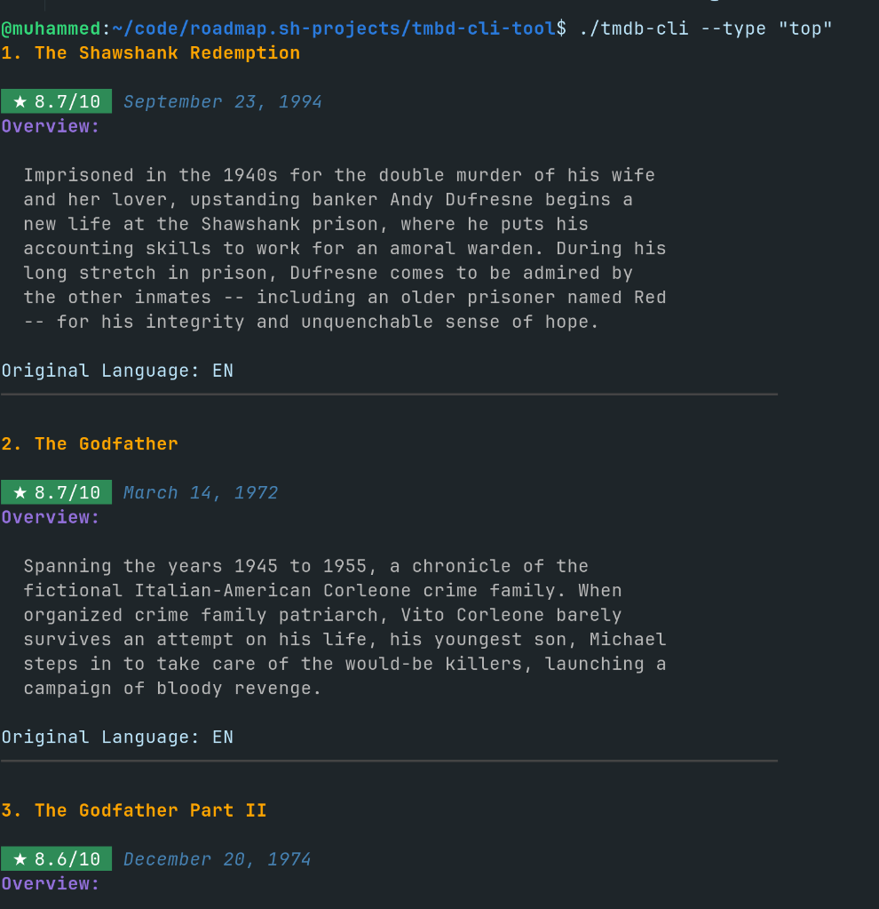

# TMDB CLI Tool
Sample solution for the [tmbd cli tool](https://roadmap.sh/projects/tmdb-cli) challenge from [roadmap.sh](https://roadmap.sh/golang/projects).

## Installation

1. Clone the repository and navigate to the project directory:
   ```bash 
   git clone https://github.com/muhammedkucukaslan/roadmap.sh-projects.git
   cd roadmap.sh-projects/tmdb-cli
   ```

2. Configure Your [TMBD](https://developer.themoviedb.org/docs/getting-started) api key into .env as `API_KEY`.

3. Build the application:
   ```bash
   go build -o tmdb-cli
   ```
## Usage

```bash
		 tmdb-cli --type <type>
Types:
		 playing
		 popular
		 top
		 upcoming

```

## Demo

