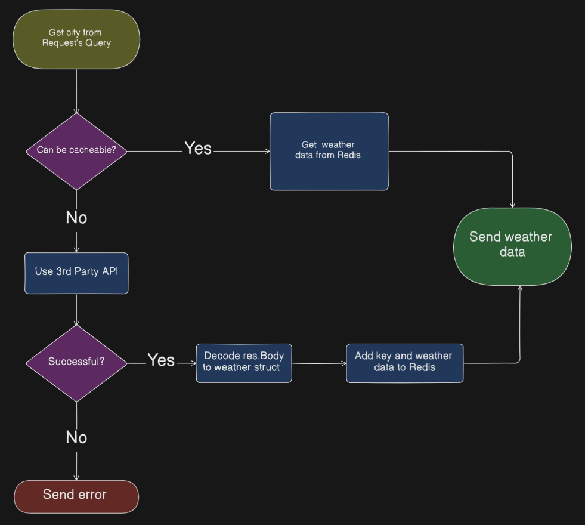

# Weather API
Sample solution for the [weather api](https://roadmap.sh/projects/weather-api-wrapper-service) challenge from [roadmap.sh](https://roadmap.sh/golang/projects).


## Overview
This project is a simple weather API built using Go, designed to retrieve weather data and integrate with Redis for caching. The application is configured to run on port 3000.

## Features
- Retrieves weather data from external APIs
- Caches responses using Redis
- Simple Go server setup

## Addition
- Logs the server and redis error messages to the log.txt file.

## Requirements
- Go 1.16+
- Redis
- Docker (optional, for containerization)

## Workflow



## Installation

1. Clone the repository and navigate to the project directory:
   ```bash
   git clone https://github.com/muhammedkucukaslan/roadmap.sh-projects.git
   cd roadmap.sh-projects/weather-api
   ```

2. Configure Redis (ensure Redis is running) and [Weather API Key](https://www.visualcrossing.com).

3. Run the application:
   ```bash
   go run .
   ```

## Usage

Send a GET request to the following endpoint:
```bash
http://localhost:3000/weather/{city}
```

## Configuration

- Ensure Redis is running locally or update the Redis host settings in `main.go`.
- Update the `WEATHER_API_KEY` environment variable with your Weather API key.

## Success Response
```bash
curl http://localhost:3000/weather/mardin 
```
```json
{
  "resolvedAddress": "Mardin, Türkiye",
  "timezone": "Europe/Istanbul",
  "days": [
    {
      "datetime": "2025-01-24",
      "sunrise": "07:25:40",
      "sunset": "17:32:18",
      "tempmax": 9.2,
      "tempmin": 5,
      "temp": 6.5,
      "description": "Clear conditions throughout the day."
    }...
  ]
}
```
## Error Response

```bash
curl http://localhost:3000/weather/invalid-city
```
```json
{
    "message":"Bad API Request:Invalid location parameter value.",
    "code":400
}
```
or any server error :

```json
{
    "message":"SERVER ERROR",
    "code":500
}
```


